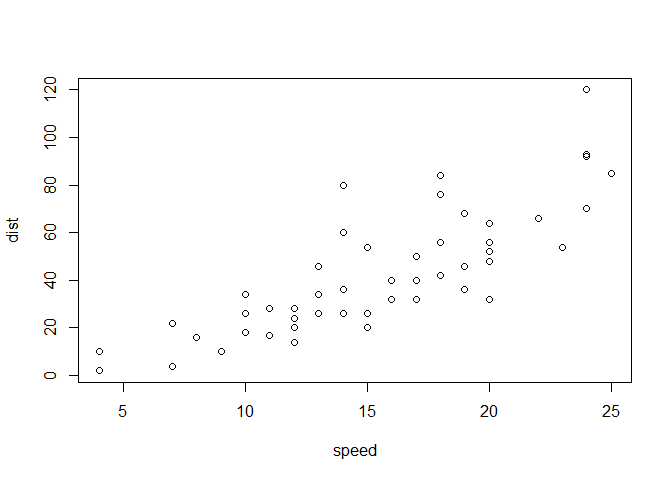

# Reproducible Research: Peer Assessment 1
grldsndrs  
January 7, 2016  


Note that the `echo = FALSE` parameter was added to the code chunk to prevent printing of the R code that generated the plot.

## Loading and preprocessing the data

This is an R Markdown document. Markdown is a simple formatting syntax for authoring HTML, PDF, and MS Word documents. For more details on using R Markdown see <http://rmarkdown.rstudio.com>.

When you click the **Knit** button a document will be generated that includes both content as well as the output of any embedded R code chunks within the document. You can embed an R code chunk like this:


```r
library(ProjectTemplate)
load.project()
tidyData <- activity[complete.cases(activity),]
# convert date to a time series by adding the intervals in minutes
dts <- as.POSIXct(tidyData$date) + minutes(as.numeric(tidyData$interval ))
# reshape data into a 1 feature time series
tidyData <- select(tidyData ,-date,-interval)%>%
xts(order.by = dts,unique = TRUE)
```

You can also embed plots, for example:

 


## What is mean total number of steps taken per day?


## What is the average daily activity pattern?


## Imputing missing values


## Are there differences in activity patterns between weekdays and weekends?
