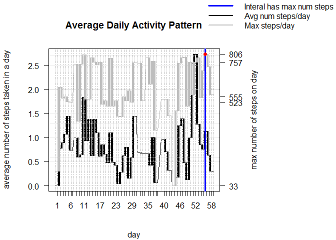

`## [1] "Mon Jan 11 00:29:00 2016"`

Loading and preprocessing the data
----------------------------------

library('ProjectTemplate') load.project()

*"Project Template"* uses the defualt settings to 'load.project()' the
csv file in the data folder of the working diriectory.

### Data cleaning

    tidyData <- activity[complete.cases(activity),]

### Data tidying

> create a time series by adding the intervals in minutes to the date

dts \<-
as.POSIXct(tidyData*d**a**t**e*) + *m**i**n**u**t**e**s*(*a**s*.*n**u**m**e**r**i**c*(*t**i**d**y**D**a**t**a*interval))

> **choose appropriate classes for features**

    tidyData <- mutate(tidyData,
                       steps= as.numeric(steps),
                       date = as.factor(date),
                       interval=as.numeric(interval))

> **create a time series**

    tidyDataXTS <- xts(tidyData ,order.by = dts,unique = TRUE)

    print(head(sample_n(tidyData,nrow(tidyData))))

    ##       steps       date interval
    ## 1558    230 2012-10-07      945
    ## 14774    69 2012-11-28      705
    ## 13700     0 2012-11-24     1335
    ## 6080      0 2012-10-24      235
    ## 9663    155 2012-11-07     1310
    ## 1376    437 2012-10-06     1835

#### What is mean total number of steps taken per day?

> calculate the ***total number of steps taken per day***

    dys = endpoints(tidyDataXTS, 'days')

    tidyData <- group_by(tidyData, date)%>%
      summarise(meanSteps.Dy = mean(steps),
                medianSteps.Dy=median(steps),
                steps.Dy = sum(steps),
                maxSteps.Dy=max(steps))%>%
      merge(tidyData)%>%
      mutate(meanSteps.Dy.Dys=(meanSteps.Dy*steps.Dy/sum(steps)))

    tidyDataXTS <- xts(tidyData ,order.by = dts,unique = TRUE)

    print(sample(tidyData$steps.Dy,10))

    ##  [1]  8334  5018  8918  7047 10119 15414 10600 11458 13646 17382

> make a histogram of the ***total number of steps taken per day***

 \>
calculate and report ***the mean***

    print(sample(tidyData$meanSteps.Dy,10))

    ##  [1] 53.52083 36.09375 73.59028 34.09375 35.77778 35.35764 24.46875
    ##  [8] 38.24653 46.15972 44.39931

> and ***the median***

    print(sample(tidyData$medianSteps.Dy,10))

    ##  [1] 0 0 0 0 0 0 0 0 0 0

> of ***total number of steps taken in a day per day***

#### What is the average daily activity pattern?

> Make a time series plot of the 5-minute interval

#### Which 5-minute interval, on average across all the days in the dataset, contains the maximum number of steps?

> ***The interval is indicated by the red dot on the above plot.***

> It is calculated:

    maxNumStepsValue = max(tidyData$steps)
    intervalOfMax = tidyData$interval[tidyData$steps==maxNumStepsValue]
    maxNumStepsDateTime = dts[tidyData$steps==maxNumStepsValue]

    ## [1] 806

    ## [1] 615

    ## [1] "11/27/12 10:15"

Inputing missing values
-----------------------

> > Note that there are a number of days/intervals where there are
> > missing values. The presence of missing days may introduce bias into
> > some calculations or summaries of the data.

> calculate and report the total number of missing values in the dataset

    summary(activity)

    ##      steps                date          interval     
    ##  Min.   :  0.00   2012-10-01:  288   Min.   :   0.0  
    ##  1st Qu.:  0.00   2012-10-02:  288   1st Qu.: 588.8  
    ##  Median :  0.00   2012-10-03:  288   Median :1177.5  
    ##  Mean   : 37.38   2012-10-04:  288   Mean   :1177.5  
    ##  3rd Qu.: 12.00   2012-10-05:  288   3rd Qu.:1766.2  
    ##  Max.   :806.00   2012-10-06:  288   Max.   :2355.0  
    ##  NA's   :2304     (Other)   :15840

> devise a strategy for filling in all of the missing values in the
> dataset.

> > Use a k nearst neighbors algorithm to predict the missing values
> > based on the known.

    tidyDataSize = nrow(tidyData)
    trainSetIndicies <- sample(x = 1:tidyDataSize,
                               size = floor(.9*tidyDataSize),
                               replace = FALSE)
    trainingSet = tidyData[trainSetIndicies,]%>%
      select(-steps,-medianSteps.Dy)%>%
      mutate(date= as.numeric(date))%>%
      scale()

    testSetIndicies <- setdiff(1:tidyDataSize,trainSetIndicies)
    testSet <- tidyData[testSetIndicies,]%>%
      select(-steps,-medianSteps.Dy)%>%
      mutate(date= as.numeric(date))%>%
      scale()

    observation <- select(tidyData[trainSetIndicies,],steps)%>%
      mutate(steps=as.factor(steps))

    testPredictions <- knn(train = trainingSet,
                           test = testSet,
                           cl = observation$steps,
                           k = floor(1.5*sqrt(tidyDataSize)),
                           prob=TRUE)

> check accuracy of predictions

    sum(as.numeric(tidyData$steps[testSetIndicies]==testPredictions))/length(testPredictions)

    ## [1] 0.7393582

> > 70% good enough for the purposes here.

> can use paramerter setting to predict the missing values

    missingValuesIndicies = is.na(activity$steps)

    > get new raw data

    unTidyData <- activity

    > get new time series

    newDts <- as.POSIXct(unTidyData$date) + minutes(as.numeric(unTidyData$interval ))

    > switch up classes for processing

    unTidyData <- mutate(unTidyData,
                         steps = as.numeric(steps),
                         date = as.factor(date),
                         interval = as.numeric(interval))

    > initialize the missing values to the mean of the day if it exists
      or the mean of the data set if not

    initialMissingValues <-
      sapply(activity$date[missingValuesIndicies], function(missingIndexDate) {
        unTidyData$steps[as.numeric(unTidyData$date)==as.numeric(missingIndexDate)] <<-
          # try to find date in complete data
          if(length(tidyData$date[as.numeric(tidyData$date)==as.numeric(missingIndexDate)]))
            # set equal to the first value in the mean per day field
            tidyData$meanSteps.Dy[as.numeric(tidyData$date)==as.numeric(missingIndexDate)][1]
        else
          # set equal to set mean
          mean(tidyData$steps)
      },simplify = TRUE)

    > prep data to predict steps with the nearest neighbor classifier

    unTidyData <- group_by(unTidyData,date)%>%
      summarise(meanSteps.Dy = mean(steps),
                medianSteps.Dy = median(steps),
                steps.Dy = sum(steps),
                maxSteps.Dy = max(steps))%>%
      merge(unTidyData)%>%
      mutate(meanSteps.Dy.Dys=(meanSteps.Dy*steps.Dy/sum(steps)))%>%
      select(-steps,-medianSteps.Dy)%>%
      mutate(date = as.numeric(date))

    testSet <- scale(unTidyData)

    > predict for all data using parameter found in training the classifier

    interpolatedTidyData <- knn(train = trainingSet,
                                test = testSet,
                                cl = observation$steps,
                                k = floor(1.5*sqrt(tidyDataSize)),
                                prob=TRUE)

    missingValues <- interpolatedTidyData[missingValuesIndicies]

> create a new dataset that is equal to the original dataset but with
> the missing data filled in.

    unTidyData$newSteps <- activity$steps
    unTidyData$newSteps[missingValuesIndicies] <- missingValues
    newTidyData <- unTidyData

    # calculate the new summary statistics
    newTidyData <- group_by(newTidyData, date)%>%
      summarise(newMeanSteps.Dy = mean(newSteps),
                newMedianSteps.Dy=median(newSteps),
                newSteps.Dy = sum(newSteps),
                newMaxSteps.Dy=max(newSteps))%>%
      merge(newTidyData)%>%
      mutate(newMeanSteps.Dy.Dys=(newMeanSteps.Dy*newSteps.Dy/sum(newSteps)))

rmarkdown::render(input="PA1\_template.Rmd",output\_format="md\_document",output\_file
= "README.md")

Note that the `echo = FALSE` parameter was added to the code chunk to
prevent printing of the R code that generated the plot.

Loading and preprocessing the data
----------------------------------

This is an R Markdown document. Markdown is a simple formatting syntax
for authoring HTML, PDF, and MS Word documents. For more details on
using R Markdown see <http://rmarkdown.rstudio.com>.

When you click the **Knit** button a document will be generated that
includes both content as well as the output of any embedded R code
chunks within the document. You can embed an R code chunk like this:

    library(ProjectTemplate)
    load.project()
    tidyData <- activity[complete.cases(activity),]
    # convert date to a time series by adding the intervals in minutes
    dts <- as.POSIXct(tidyData$date) + minutes(as.numeric(tidyData$interval ))
    # reshape data into a 1 feature time series
    tidyData <- select(tidyData ,-date,-interval)%>%
    xts(order.by = dts,unique = TRUE)

You can also embed plots, for example:

What is mean total number of steps taken per day?
-------------------------------------------------

What is the average daily activity pattern?
-------------------------------------------

Imputing missing values
-----------------------

Are there differences in activity patterns between weekdays and weekends?
-------------------------------------------------------------------------
