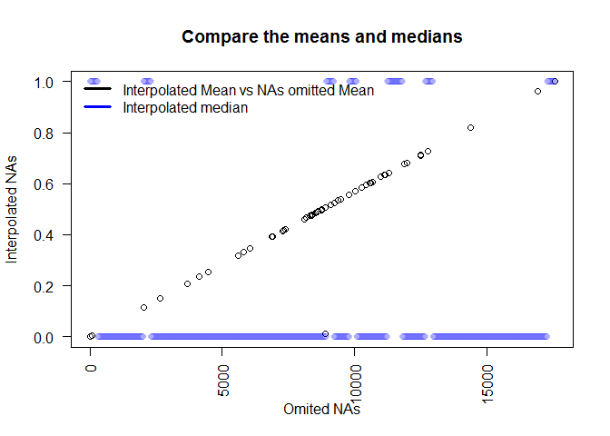
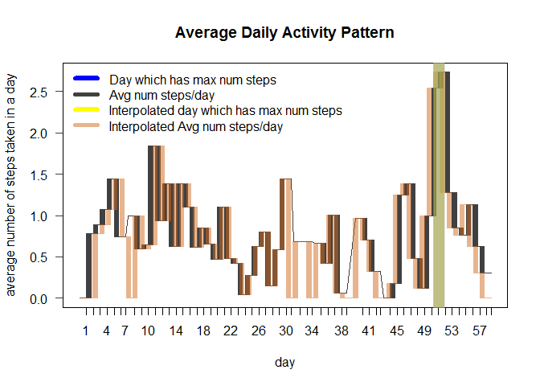
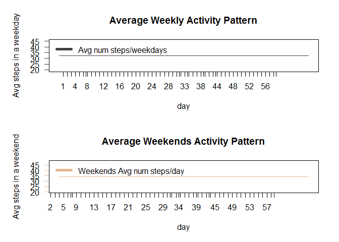

# Reproducible Research: Peer Assessment 1
grldsndrs  
January 7, 2016  
 
 ```
 ## [1] "Mon Jan 11 00:50:37 2016"
 ```

## Loading and preprocessing the data

library('ProjectTemplate')
load.project()

 _"Project Template"_ uses the defualt settings to 'load.project()' the csv
 file in the data folder of the working diriectory.

### Data cleaning


```r
tidyData <- activity[complete.cases(activity),]
```

### Data tidying

> create a time series by adding the intervals in minutes to the date

dts <- as.POSIXct(tidyData$date) + minutes(as.numeric(tidyData$interval))

> __choose appropriate classes for features__


```r
tidyData <- mutate(tidyData,
                   steps= as.numeric(steps),
                   date = as.factor(date),
                   interval=as.numeric(interval))
```

> __create a time series__


```r
tidyDataXTS <- xts(tidyData ,order.by = dts,unique = TRUE)
```


```r
print(head(sample_n(tidyData,nrow(tidyData))))
```

```
##       steps       date interval
## 11146     0 2012-11-15     1645
## 14820     0 2012-11-28     1055
## 5004      0 2012-10-20      855
## 8810     44 2012-11-03     1405
## 4936      0 2012-10-20      315
## 13827     0 2012-11-25       10
```

#### What is mean total number of steps taken per day?

> calculate the **_total number of steps taken per day_**


```r
dys = endpoints(tidyDataXTS, 'days')

tidyData <- group_by(tidyData, date)%>%
  summarise(meanSteps.Dy = mean(steps),
            medianSteps.Dy=median(steps),
            steps.Dy = sum(steps),
            maxSteps.Dy=max(steps))%>%
  merge(tidyData)%>%
  mutate(meanSteps.Dy.Dys=(meanSteps.Dy*steps.Dy/sum(steps)))

tidyDataXTS <- xts(tidyData ,order.by = dts,unique = TRUE)
```


```r
print(sample(tidyData$steps.Dy,10))
```

```
##  [1] 15098  5018 10571 12116 13460 12116  4472 13452 11829 10183
```

> make a histogram of the **_total number of steps taken per day_**

 
> calculate and report **_the mean_**


```r
print(sample(tidyData$meanSteps.Dy,10))
```

```
##  [1]  0.4375000 47.3819444  0.1423611 11.1770833 23.5347222 37.3784722
##  [7] 36.8055556 50.2708333 34.9166667 46.1597222
```

 > and **_the median_**
 

```r
print(sample(tidyData$medianSteps.Dy,10))
```

```
##  [1] 0 0 0 0 0 0 0 0 0 0
```

> of **_total number of steps taken in a day per day_**

#### What is the average daily activity pattern?

> Make a time series plot of the 5-minute interval

 

#### Which 5-minute interval, on average across all the days in the dataset, contains the maximum number of steps?

> **_The interval is indicated by the red dot on the above plot._**

> It is calculated:


```r
maxNumStepsValue = max(tidyData$steps)
intervalOfMax = tidyData$interval[tidyData$steps==maxNumStepsValue]
maxNumStepsDateTime = dts[tidyData$steps==maxNumStepsValue]
```


```
## [1] 806
```

```
## [1] 615
```

```
## [1] "11/27/12 10:15"
```


## Inputing missing values

>> Note that there are a number of days/intervals where there are missing values.
>> The presence of missing days may introduce bias into some calculations or summaries of the data.

> calculate and report the total number of missing values in the dataset


```r
summary(activity)
```

```
##      steps                date          interval     
##  Min.   :  0.00   2012-10-01:  288   Min.   :   0.0  
##  1st Qu.:  0.00   2012-10-02:  288   1st Qu.: 588.8  
##  Median :  0.00   2012-10-03:  288   Median :1177.5  
##  Mean   : 37.38   2012-10-04:  288   Mean   :1177.5  
##  3rd Qu.: 12.00   2012-10-05:  288   3rd Qu.:1766.2  
##  Max.   :806.00   2012-10-06:  288   Max.   :2355.0  
##  NA's   :2304     (Other)   :15840
```


> devise a strategy for filling in all of the missing values in the dataset.

>> Use a k nearst neighbors algorithm to predict the missing values based on the known.


```r
tidyDataSize = nrow(tidyData)
trainSetIndicies <- sample(x = 1:tidyDataSize,
                           size = floor(.9*tidyDataSize),
                           replace = FALSE)
trainingSet = tidyData[trainSetIndicies,]%>%
  select(-steps,-medianSteps.Dy)%>%
  mutate(date= as.numeric(date))%>%
  scale()

testSetIndicies <- setdiff(1:tidyDataSize,trainSetIndicies)
testSet <- tidyData[testSetIndicies,]%>%
  select(-steps,-medianSteps.Dy)%>%
  mutate(date= as.numeric(date))%>%
  scale()

observation <- select(tidyData[trainSetIndicies,],steps)%>%
  mutate(steps=as.factor(steps))

testPredictions <- knn(train = trainingSet,
                       test = testSet,
                       cl = observation$steps,
                       k = floor(1.5*sqrt(tidyDataSize)),
                       prob=TRUE)
```


> check accuracy of predictions


```r
sum(as.numeric(tidyData$steps[testSetIndicies]==testPredictions))/length(testPredictions)
```

```
## [1] 0.7393582
```


>> 70% good enough for the purposes here. \n

> can use paramerter setting to predict the missing values


```r
missingValuesIndicies = is.na(activity$steps)

> get new raw data

unTidyData <- activity

> get new time series

newDts <- as.POSIXct(unTidyData$date) + minutes(as.numeric(unTidyData$interval ))

> switch up classes for processing

unTidyData <- mutate(unTidyData,
                     steps = as.numeric(steps),
                     date = as.factor(date),
                     interval = as.numeric(interval))

initialize the missing values to the mean of the day if it exists
  or the mean of the data set if not

initialMissingValues <-
  sapply(activity$date[missingValuesIndicies], function(missingIndexDate) {
    unTidyData$steps[as.numeric(unTidyData$date)==as.numeric(missingIndexDate)] <<-
      # try to find date in complete data
      if(length(tidyData$date[as.numeric(tidyData$date)==as.numeric(missingIndexDate)]))
        # set equal to the first value in the mean per day field
        tidyData$meanSteps.Dy[as.numeric(tidyData$date)==as.numeric(missingIndexDate)][1]
    else
      # set equal to set mean
      mean(tidyData$steps)
  },simplify = TRUE)

prep data to predict steps with the nearest neighbor classifier

unTidyData <- group_by(unTidyData,date)%>%
  summarise(meanSteps.Dy = mean(steps),
            medianSteps.Dy = median(steps),
            steps.Dy = sum(steps),
            maxSteps.Dy = max(steps))%>%
  merge(unTidyData)%>%
  mutate(meanSteps.Dy.Dys=(meanSteps.Dy*steps.Dy/sum(steps)))%>%
  select(-steps,-medianSteps.Dy)%>%
  mutate(date = as.numeric(date))

testSet <- scale(unTidyData)

predict for all data using parameter found in training the classifier

interpolatedTidyData <- knn(train = trainingSet,
                            test = testSet,
                            cl = observation$steps,
                            k = floor(1.5*sqrt(tidyDataSize)),
                            prob=TRUE)

missingValues <- interpolatedTidyData[missingValuesIndicies]
```


> create a new dataset that is equal to the original dataset but with the missing data filled in.


```r
unTidyData$newSteps <- activity$steps
unTidyData$newSteps[missingValuesIndicies] <- missingValues
newTidyData <- unTidyData

calculate the new summary statistics

newTidyData <- group_by(newTidyData, date)%>%
  summarise(newMeanSteps.Dy = mean(newSteps),
            newMedianSteps.Dy=median(newSteps),
            newSteps.Dy = sum(newSteps),
            newMaxSteps.Dy=max(newSteps))%>%
  merge(newTidyData)%>%
  mutate(newMeanSteps.Dy.Dys=(newMeanSteps.Dy*newSteps.Dy/sum(newSteps)))
```

> create a new time series

newTidyDataXTS <- xts(newTidyData ,order.by = newDts,unique = TRUE)


> make a histogram of the total number of steps taken each day


```r
print(sample(newTidyData$newSteps.Dy,10))
```

```
##  [1] 15110  7047 13452 10395    41  8355 11829 12811  5441 12116
```

> make a histogram of the **_total number of steps taken per day_**


create extra margin room on the right for an axis


 

> calculate and report **_the mean_**


```r
print(sample(newTidyData$newMeanSteps.Dy,10))
```

```
##  [1] 15.52778 15.52778 30.69792 50.27083  0.43750 42.06944 52.46528
##  [8] 36.09375 73.59028 46.70833
```

> and **_the median_**


```r
print(sample(newTidyData$newMedianSteps.Dy,10))
```

```
##  [1] 1 0 1 1 0 0 0 0 0 0
```

> of **_total number of steps taken in a day per day_**

#### Do these values differ from the estimates from the first part of the assignment?

 

 

#### What is the impact of inputing missing data on the estimates of the total daily number of steps?

>> _From the above graph it can be seen how the interpolated data is shifted.
The brown lines follow closely the black but is slightly shifted in time.
This is a direct resut of the k nearest neighbor classification algorithm,
 employed to predict the missing values._

>> _Additionally the day with the max average has not changed.
   Note the greenish  transparent line at day 50. The greenish color is caused by
   the over lap of the data points from both series (blue and yellow)._

### Are there differences in activity patterns between weekdays and weekends?
#### Use the dataset with the filled-in missing values for this part.

> Create a new factor variable in the dataset with two levels – “weekday” and “weekend”

> indicating whether a given date is a weekday or weekend day.


```r
weekDayIndices = !(weekdays(newDts,TRUE)==c("Fri" ,"Sat" ,"Sun"))
weekEndIndices = (weekdays(newDts,TRUE)==c("Fri" ,"Sat" ,"Sun"))

Calculate the summary statistics

newTidyData <- mutate(newTidyData,
                      dayClass = factor(        # create the weekday/end factor
                        1+(weekEndIndices),
                        labels = c("day","end"),
                        levels = c(1,2)))

newTidyData.Wd <- newTidyData[weekDayIndices,]
newTidyData.Wd <-
  group_by(newTidyData.Wd,dayClass)%>%
  summarise(newMeanSteps.Wd = mean(newSteps),  # calculate the weighted average of weekdays
            newMedianSteps.Wd = median(newSteps),
            newSteps.Wd = sum(newSteps),
            newMaxSteps.Wd = max(newSteps))%>%
  merge(newTidyData.Wd)%>%
  mutate(newMeanSteps.Wd.Wds=(newMeanSteps.Wd*newSteps.Wd/sum(newSteps)))

newTidyData.We <- newTidyData[weekEndIndices,]
newTidyData.We <-
  group_by(newTidyData.We,dayClass)%>%
  summarise(newMeanSteps.We = mean(newSteps),    # calculate the weighted average of weekends
            newMedianSteps.We=median(newSteps),
            newSteps.We = sum(newSteps),
            newMaxSteps.We=max(newSteps))%>%
  merge(newTidyData.We)%>%
  mutate(newMeanSteps.We.Wes=(newMeanSteps.We*newSteps.We/sum(newSteps)))

newTidyDataXTS.Wd <- xts(newTidyData.Wd ,order.by = newDts[weekDayIndices],unique = TRUE)
newTidyDataXTS.We <- xts(newTidyData.We ,order.by = newDts[weekEndIndices],unique = TRUE)
```

Make a panel plot containing a time series plot of
the 5-minute interval and the average number of steps taken,
averaged across all weekday days or weekend days.

 

>> **There appears to be some difference in the activity partern
based on the weekend and weekday averages in the above graphs and show here respectivley**


```r
head(newTidyDataXTS.We$newMeanSteps.We.Wes)
```

```
##                     newMeanSteps.We.Wes
## 2012-10-05 00:00:00 "34.22528"         
## 2012-10-05 00:05:00 "34.22528"         
## 2012-10-05 00:15:00 "34.22528"         
## 2012-10-05 00:30:00 "34.22528"         
## 2012-10-05 00:45:00 "34.22528"         
## 2012-10-05 01:00:00 "34.22528"
```

```r
head(newTidyDataXTS.Wd$newMeanSteps.Wd.Wds)
```

```
##                     newMeanSteps.Wd.Wds
## 2012-10-01 00:00:00 "32.35113"         
## 2012-10-01 00:05:00 "32.35113"         
## 2012-10-01 00:10:00 "32.35113"         
## 2012-10-01 00:15:00 "32.35113"         
## 2012-10-01 00:20:00 "32.35113"         
## 2012-10-01 00:25:00 "32.35113"
```

rmarkdown::render(input="PA1_template.Rmd",output_format="md_document",output_file = "README.md")
