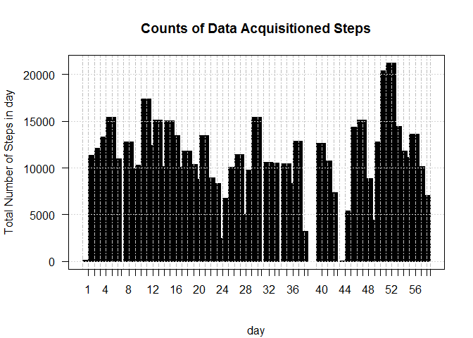
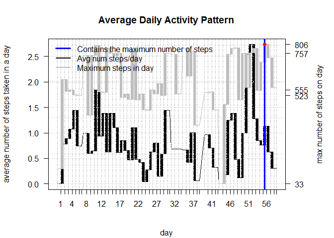

    ## [1] "Sat Jan 09 11:25:49 2016"

Loading and preprocessing the data
----------------------------------

> *"Project Template"* uses the defualt settings to load the csv file in
> the data folder of the working diriectory.

### Data cleaning

    tidyData <- activity[complete.cases(activity),]

### Data tidying

    # create a time series by adding the intervals in minutes to the date
    dts <- as.POSIXct(tidyData$date) + minutes(as.numeric(tidyData$interval ))

> choose appropriate classes for features

    tidyData <- mutate(tidyData,steps= as.numeric(steps),date = as.factor(date),interval=as.numeric(interval))

> create a time series

    tidyDataXTS <- xts(tidyData ,order.by = dts,unique = TRUE)

    ##       steps       date interval
    ## 12195    64 2012-11-19      810
    ## 14111     0 2012-11-25     2350
    ## 9557      0 2012-11-07      420
    ## 12267     0 2012-11-19     1410
    ## 15261     0 2012-11-29     2340
    ## 8308      0 2012-10-31     2015

#### What is mean total number of steps taken per day?

> calculate the ***total number of steps taken per day***

    dys = endpoints(tidyDataXTS, 'days')
    tidyData <- group_by(tidyData, date)%>%
      summarise(meanSteps.Dy = mean(steps),
                medianSteps.Dy=median(steps),
                steps.Dy = sum(steps),
                maxSteps.Dy=max(steps))%>%
      merge(tidyData)%>%
      mutate(meanSteps.Dy.Dys=(meanSteps.Dy*steps.Dy/sum(steps)))

    tidyDataXTS <- xts(tidyData ,order.by = dts,unique = TRUE)

    print(sample(tidyData$steps.Dy,10))

    ##  [1] 12608 11352  4472  8355   126 20427 10304  7336 15084 10056

> make a histogram of the ***total number of steps taken per day***
> 

> calculate and report ***the mean***

    print(sample(tidyData$meanSteps.Dy,10))

    ##  [1] 34.91667 28.93750 38.75694 34.91667 28.93750 46.73611 46.73611
    ##  [8] 36.09375 44.73264 44.73264

> and ***the median***

    print(sample(tidyData$medianSteps.Dy,10))

    ##  [1] 0 0 0 0 0 0 0 0 0 0

> of ***total number of steps taken in a day per day***

#### What is the average daily activity pattern?

> Make a time series plot of the 5-minute interval
> 

#### Which 5-minute interval, on average across all the days in the dataset, contains the maximum number of steps?

> ***The interval is indicated by the red dot on the above plot.*** It
> is calculated:

    maxNumStepsValue = max(tidyData$steps)
    maxNumSteps = dts[tidyData$steps==maxNumStepsValue]

    ## [1] "11/27/12 10:15"

Imputing missing values
-----------------------

> > Note that there are a number of days/intervals where there are
> > missing values. The presence of missing days may introduce bias into
> > some calculations or summaries of the data.

> calculate and report the total number of missing values in the
> dataset.

> devise a strategy for filling in all of the missing values in the
> dataset. \> The strategy does not need to be sophisticated. For
> example, you could use the mean/median for that day, or the mean for
> that 5-minute interval, etc.

> create a new dataset that is equal to the original dataset but with
> the missing data filled in.

> make a histogram of the total number of steps taken each day

> calculate and report the mean and median total number of steps taken
> per day.

#### Do these values differ from the estimates from the first part of the assignment?

#### What is the impact of imputing missing data on the estimates of the total daily number of steps?

#### Are there differences in activity patterns between weekdays and weekends?

    # #
    # library('ProjectTemplate')
    # load.project()
    # # And then goes on to do something original with the data:

    ##   plot1 <- ggplot(first.letter.counts, aes(x = V1)) + geom_density()
    ## ggsave(file.path('graphs', 'plot1.pdf'))
    #
    ## plot2 <- ggplot(second.letter.counts, aes(x = V1)) + geom_density()
    ## ggsave(file.path('graphs', 'plot2.pdf'))

    ## [1] "Sat Jan 09 11:25:52 2016"

Loading and preprocessing the data
----------------------------------

> *"Project Template"* uses the defualt settings to load the csv file in
> the data folder of the working diriectory.

### Data cleaning

    tidyData <- activity[complete.cases(activity),]

### Data tidying

    # create a time series by adding the intervals in minutes to the date
    dts <- as.POSIXct(tidyData$date) + minutes(as.numeric(tidyData$interval ))

> choose appropriate classes for features

    tidyData <- mutate(tidyData,steps= as.numeric(steps),date = as.factor(date),interval=as.numeric(interval))

> create a time series

    tidyDataXTS <- xts(tidyData ,order.by = dts,unique = TRUE)

    ##       steps       date interval
    ## 10551     0 2012-11-12     1510
    ## 7157      0 2012-10-27     2020
    ## 6182      0 2012-10-24     1105
    ## 13685    38 2012-11-24     1220
    ## 3657      0 2012-10-15     1640
    ## 5658      0 2012-10-22     1525

#### What is mean total number of steps taken per day?

> calculate the ***total number of steps taken per day***

    dys = endpoints(tidyDataXTS, 'days')
    tidyData <- group_by(tidyData, date)%>%
      summarise(meanSteps.Dy = mean(steps),
                medianSteps.Dy=median(steps),
                steps.Dy = sum(steps),
                maxSteps.Dy=max(steps))%>%
      merge(tidyData)%>%
      mutate(meanSteps.Dy.Dys=(meanSteps.Dy*steps.Dy/sum(steps)))

    tidyDataXTS <- xts(tidyData ,order.by = dts,unique = TRUE)

    print(sample(tidyData$steps.Dy,10))

    ##  [1] 15420  8841  6778 11015 11352  7336 10119 10600  9900 12426

> make a histogram of the ***total number of steps taken per day***
> 

> calculate and report ***the mean***

    print(sample(tidyData$meanSteps.Dy,10))

    ##  [1] 34.9166667  0.1423611 52.4652778 36.0937500 52.4652778  0.4375000
    ##  [7] 17.4236111 70.9270833 53.5208333 44.7326389

> and ***the median***

    print(sample(tidyData$medianSteps.Dy,10))

    ##  [1] 0 0 0 0 0 0 0 0 0 0

> of ***total number of steps taken in a day per day***

#### What is the average daily activity pattern?

> Make a time series plot of the 5-minute interval
> 

#### Which 5-minute interval, on average across all the days in the dataset, contains the maximum number of steps?

> ***The interval is indicated by the red dot on the above plot.*** It
> is calculated:

    maxNumStepsValue = max(tidyData$steps)
    maxNumSteps = dts[tidyData$steps==maxNumStepsValue]

    ## [1] "11/27/12 10:15"

Imputing missing values
-----------------------

> > Note that there are a number of days/intervals where there are
> > missing values. The presence of missing days may introduce bias into
> > some calculations or summaries of the data.

> calculate and report the total number of missing values in the
> dataset.

> devise a strategy for filling in all of the missing values in the
> dataset. \> The strategy does not need to be sophisticated. For
> example, you could use the mean/median for that day, or the mean for
> that 5-minute interval, etc.

> create a new dataset that is equal to the original dataset but with
> the missing data filled in.

> make a histogram of the total number of steps taken each day

> calculate and report the mean and median total number of steps taken
> per day.

#### Do these values differ from the estimates from the first part of the assignment?

#### What is the impact of imputing missing data on the estimates of the total daily number of steps?

#### Are there differences in activity patterns between weekdays and weekends?

    # #
    # library('ProjectTemplate')
    # load.project()
    # # And then goes on to do something original with the data:

    ##   plot1 <- ggplot(first.letter.counts, aes(x = V1)) + geom_density()
    ## ggsave(file.path('graphs', 'plot1.pdf'))
    #
    ## plot2 <- ggplot(second.letter.counts, aes(x = V1)) + geom_density()
    ## ggsave(file.path('graphs', 'plot2.pdf'))

    ## [1] "Sat Jan 09 11:25:55 2016"

Loading and preprocessing the data
----------------------------------

> *"Project Template"* uses the defualt settings to load the csv file in
> the data folder of the working diriectory.

### Data cleaning

    tidyData <- activity[complete.cases(activity),]

### Data tidying

    # create a time series by adding the intervals in minutes to the date
    dts <- as.POSIXct(tidyData$date) + minutes(as.numeric(tidyData$interval ))

> choose appropriate classes for features

    tidyData <- mutate(tidyData,steps= as.numeric(steps),date = as.factor(date),interval=as.numeric(interval))

> create a time series

    tidyDataXTS <- xts(tidyData ,order.by = dts,unique = TRUE)

    ##       steps       date interval
    ## 3874      0 2012-10-16     1045
    ## 11627     0 2012-11-17      850
    ## 13348     0 2012-11-23      815
    ## 3976     67 2012-10-16     1915
    ## 1494      0 2012-10-07      425
    ## 13900     0 2012-11-25      615

#### What is mean total number of steps taken per day?

> calculate the ***total number of steps taken per day***

    dys = endpoints(tidyDataXTS, 'days')
    tidyData <- group_by(tidyData, date)%>%
      summarise(meanSteps.Dy = mean(steps),
                medianSteps.Dy=median(steps),
                steps.Dy = sum(steps),
                maxSteps.Dy=max(steps))%>%
      merge(tidyData)%>%
      mutate(meanSteps.Dy.Dys=(meanSteps.Dy*steps.Dy/sum(steps)))

    tidyDataXTS <- xts(tidyData ,order.by = dts,unique = TRUE)

    print(sample(tidyData$steps.Dy,10))

    ##  [1] 15414 13452 12787 17382 11352  5018  7336  9900 21194   126

> make a histogram of the ***total number of steps taken per day***
> 

> calculate and report ***the mean***

    print(sample(tidyData$meanSteps.Dy,10))

    ##  [1] 34.09375 44.73264 50.27083 41.09028 46.70833 47.38194 42.06944
    ##  [8] 25.47222 24.46875 39.78472

> and ***the median***

    print(sample(tidyData$medianSteps.Dy,10))

    ##  [1] 0 0 0 0 0 0 0 0 0 0

> of ***total number of steps taken in a day per day***

#### What is the average daily activity pattern?

> Make a time series plot of the 5-minute interval
> 

#### Which 5-minute interval, on average across all the days in the dataset, contains the maximum number of steps?

> ***The interval is indicated by the red dot on the above plot.*** It
> is calculated:

    maxNumStepsValue = max(tidyData$steps)
    maxNumSteps = dts[tidyData$steps==maxNumStepsValue]

    ## [1] "11/27/12 10:15"

Imputing missing values
-----------------------

> > Note that there are a number of days/intervals where there are
> > missing values. The presence of missing days may introduce bias into
> > some calculations or summaries of the data.

> calculate and report the total number of missing values in the
> dataset.

> devise a strategy for filling in all of the missing values in the
> dataset. \> The strategy does not need to be sophisticated. For
> example, you could use the mean/median for that day, or the mean for
> that 5-minute interval, etc.

> create a new dataset that is equal to the original dataset but with
> the missing data filled in.

> make a histogram of the total number of steps taken each day

> calculate and report the mean and median total number of steps taken
> per day.

#### Do these values differ from the estimates from the first part of the assignment?

#### What is the impact of imputing missing data on the estimates of the total daily number of steps?

#### Are there differences in activity patterns between weekdays and weekends?

    # #
    # library('ProjectTemplate')
    # load.project()
    # # And then goes on to do something original with the data:

    ##   plot1 <- ggplot(first.letter.counts, aes(x = V1)) + geom_density()
    ## ggsave(file.path('graphs', 'plot1.pdf'))
    #
    ## plot2 <- ggplot(second.letter.counts, aes(x = V1)) + geom_density()
    ## ggsave(file.path('graphs', 'plot2.pdf'))

    ## [1] "Sat Jan 09 11:25:58 2016"

Loading and preprocessing the data
----------------------------------

> *"Project Template"* uses the defualt settings to load the csv file in
> the data folder of the working diriectory.

### Data cleaning

    tidyData <- activity[complete.cases(activity),]

### Data tidying

    # create a time series by adding the intervals in minutes to the date
    dts <- as.POSIXct(tidyData$date) + minutes(as.numeric(tidyData$interval ))

> choose appropriate classes for features

    tidyData <- mutate(tidyData,steps= as.numeric(steps),date = as.factor(date),interval=as.numeric(interval))

> create a time series

    tidyDataXTS <- xts(tidyData ,order.by = dts,unique = TRUE)

    ##       steps       date interval
    ## 13463     0 2012-11-23     1750
    ## 8522     17 2012-11-02     1405
    ## 6030      0 2012-10-23     2225
    ## 14036     0 2012-11-25     1735
    ## 12620    52 2012-11-20     1935
    ## 5161      0 2012-10-20     2200

#### What is mean total number of steps taken per day?

> calculate the ***total number of steps taken per day***

    dys = endpoints(tidyDataXTS, 'days')
    tidyData <- group_by(tidyData, date)%>%
      summarise(meanSteps.Dy = mean(steps),
                medianSteps.Dy=median(steps),
                steps.Dy = sum(steps),
                maxSteps.Dy=max(steps))%>%
      merge(tidyData)%>%
      mutate(meanSteps.Dy.Dys=(meanSteps.Dy*steps.Dy/sum(steps)))

    tidyDataXTS <- xts(tidyData ,order.by = dts,unique = TRUE)

    print(sample(tidyData$steps.Dy,10))

    ##  [1]  3219 15084 12426 11162 10395 10765   126 15084 12787 17382

> make a histogram of the ***total number of steps taken per day***
> 

> calculate and report ***the mean***

    print(sample(tidyData$meanSteps.Dy,10))

    ##  [1] 18.89236 50.27083 36.70486 60.35417 11.17708 35.77778 35.35764
    ##  [8] 36.70486 30.69792 23.53472

> and ***the median***

    print(sample(tidyData$medianSteps.Dy,10))

    ##  [1] 0 0 0 0 0 0 0 0 0 0

> of ***total number of steps taken in a day per day***

#### What is the average daily activity pattern?

> Make a time series plot of the 5-minute interval
> 

#### Which 5-minute interval, on average across all the days in the dataset, contains the maximum number of steps?

> ***The interval is indicated by the red dot on the above plot.*** It
> is calculated:

    maxNumStepsValue = max(tidyData$steps)
    maxNumSteps = dts[tidyData$steps==maxNumStepsValue]

    ## [1] "11/27/12 10:15"

Imputing missing values
-----------------------

> > Note that there are a number of days/intervals where there are
> > missing values. The presence of missing days may introduce bias into
> > some calculations or summaries of the data.

> calculate and report the total number of missing values in the
> dataset.

> devise a strategy for filling in all of the missing values in the
> dataset. \> The strategy does not need to be sophisticated. For
> example, you could use the mean/median for that day, or the mean for
> that 5-minute interval, etc.

> create a new dataset that is equal to the original dataset but with
> the missing data filled in.

> make a histogram of the total number of steps taken each day

> calculate and report the mean and median total number of steps taken
> per day.

#### Do these values differ from the estimates from the first part of the assignment?

#### What is the impact of imputing missing data on the estimates of the total daily number of steps?

#### Are there differences in activity patterns between weekdays and weekends?

    # #
    # library('ProjectTemplate')
    # load.project()
    # # And then goes on to do something original with the data:

    ##   plot1 <- ggplot(first.letter.counts, aes(x = V1)) + geom_density()
    ## ggsave(file.path('graphs', 'plot1.pdf'))
    #
    ## plot2 <- ggplot(second.letter.counts, aes(x = V1)) + geom_density()
    ## ggsave(file.path('graphs', 'plot2.pdf'))

    ## [1] "Sat Jan 09 11:26:00 2016"

Loading and preprocessing the data
----------------------------------

> *"Project Template"* uses the defualt settings to load the csv file in
> the data folder of the working diriectory.

### Data cleaning

    tidyData <- activity[complete.cases(activity),]

### Data tidying

    # create a time series by adding the intervals in minutes to the date
    dts <- as.POSIXct(tidyData$date) + minutes(as.numeric(tidyData$interval ))

> choose appropriate classes for features

    tidyData <- mutate(tidyData,steps= as.numeric(steps),date = as.factor(date),interval=as.numeric(interval))

> create a time series

    tidyDataXTS <- xts(tidyData ,order.by = dts,unique = TRUE)

    ##       steps       date interval
    ## 2597      0 2012-10-12       20
    ## 7426     76 2012-10-28     1845
    ## 9889    102 2012-11-08      800
    ## 11773    45 2012-11-17     2100
    ## 6498      0 2012-10-25     1325
    ## 10575     0 2012-11-12     1710

#### What is mean total number of steps taken per day?

> calculate the ***total number of steps taken per day***

    dys = endpoints(tidyDataXTS, 'days')
    tidyData <- group_by(tidyData, date)%>%
      summarise(meanSteps.Dy = mean(steps),
                medianSteps.Dy=median(steps),
                steps.Dy = sum(steps),
                maxSteps.Dy=max(steps))%>%
      merge(tidyData)%>%
      mutate(meanSteps.Dy.Dys=(meanSteps.Dy*steps.Dy/sum(steps)))

    tidyDataXTS <- xts(tidyData ,order.by = dts,unique = TRUE)

    print(sample(tidyData$steps.Dy,10))

    ##  [1]  6778 21194 11458 10765 11458 11352 11352 10304 17382 13452

> make a histogram of the ***total number of steps taken per day***
> 

> calculate and report ***the mean***

    print(sample(tidyData$meanSteps.Dy,10))

    ##  [1] 43.14583 34.09375 44.48264 25.47222 35.35764 15.52778 28.93750
    ##  [8] 44.73264 53.54167 38.75694

> and ***the median***

    print(sample(tidyData$medianSteps.Dy,10))

    ##  [1] 0 0 0 0 0 0 0 0 0 0

> of ***total number of steps taken in a day per day***

#### What is the average daily activity pattern?

> Make a time series plot of the 5-minute interval
> 

#### Which 5-minute interval, on average across all the days in the dataset, contains the maximum number of steps?

> ***The interval is indicated by the red dot on the above plot.*** It
> is calculated:

    maxNumStepsValue = max(tidyData$steps)
    maxNumSteps = dts[tidyData$steps==maxNumStepsValue]

    ## [1] "11/27/12 10:15"

Imputing missing values
-----------------------

> > Note that there are a number of days/intervals where there are
> > missing values. The presence of missing days may introduce bias into
> > some calculations or summaries of the data.

> calculate and report the total number of missing values in the
> dataset.

> devise a strategy for filling in all of the missing values in the
> dataset. \> The strategy does not need to be sophisticated. For
> example, you could use the mean/median for that day, or the mean for
> that 5-minute interval, etc.

> create a new dataset that is equal to the original dataset but with
> the missing data filled in.

> make a histogram of the total number of steps taken each day

> calculate and report the mean and median total number of steps taken
> per day.

#### Do these values differ from the estimates from the first part of the assignment?

#### What is the impact of imputing missing data on the estimates of the total daily number of steps?

#### Are there differences in activity patterns between weekdays and weekends?

    # #
    # library('ProjectTemplate')
    # load.project()
    # # And then goes on to do something original with the data:

    ##   plot1 <- ggplot(first.letter.counts, aes(x = V1)) + geom_density()
    ## ggsave(file.path('graphs', 'plot1.pdf'))
    #
    ## plot2 <- ggplot(second.letter.counts, aes(x = V1)) + geom_density()
    ## ggsave(file.path('graphs', 'plot2.pdf'))
