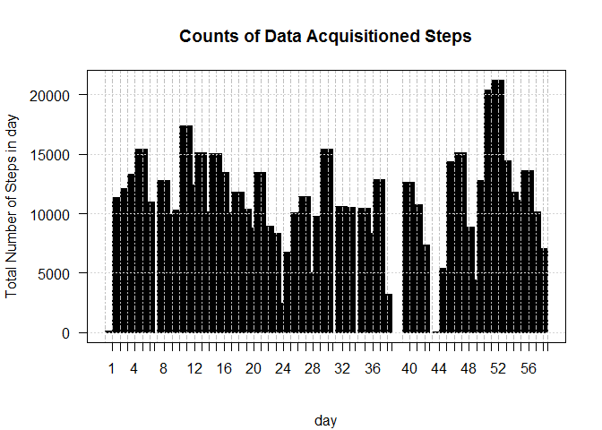

    ## [1] "Sat Jan 09 11:16:20 2016"

Loading and preprocessing the data
----------------------------------

> *"Project Template"* uses the defualt settings to load the csv file in
> the data folder of the working diriectory.

### Data cleaning

    tidyData <- activity[complete.cases(activity),]

### Data tidying

    # create a time series by adding the intervals in minutes to the date
    dts <- as.POSIXct(tidyData$date) + minutes(as.numeric(tidyData$interval ))

> choose appropriate classes for features

    tidyData <- mutate(tidyData,steps= as.numeric(steps),date = as.factor(date),interval=as.numeric(interval))

> create a time series

    tidyDataXTS <- xts(tidyData ,order.by = dts,unique = TRUE)

    ##       steps       date interval
    ## 13936   190 2012-11-25      915
    ## 10060    87 2012-11-08     2215
    ## 5310      0 2012-10-21     1025
    ## 4735      0 2012-10-19     1030
    ## 12821     0 2012-11-21     1220
    ## 12213     0 2012-11-19      940

#### What is mean total number of steps taken per day?

> calculate the ***total number of steps taken per day***

    dys = endpoints(tidyDataXTS, 'days')
    tidyData <- group_by(tidyData, date)%>%
      summarise(meanSteps.Dy = mean(steps),
                medianSteps.Dy=median(steps),
                steps.Dy = sum(steps),
                maxSteps.Dy=max(steps))%>%
      merge(tidyData)%>%
      mutate(meanSteps.Dy.Dys=(meanSteps.Dy*steps.Dy/sum(steps)))

    tidyDataXTS <- xts(tidyData ,order.by = dts,unique = TRUE)

    print(sample(tidyData$steps.Dy,10))

    ##  [1] 12811 11829 10056 14478 15084 10571 12116  8355 10439 13646

> make a histogram of the ***total number of steps taken per day***
> 

> calculate and report ***the mean***

    print(sample(tidyData$meanSteps.Dy,10))

    ##  [1] 37.37847 41.09028 34.37500 49.78819 39.41667 36.24653 43.77778
    ##  [8] 35.77778 44.48264 46.15972

> and ***the median***

    print(sample(tidyData$medianSteps.Dy,10))

    ##  [1] 0 0 0 0 0 0 0 0 0 0

> of ***total number of steps taken in a day per day***

#### What is the average daily activity pattern?

> Make a time series plot of the 5-minute interval
> 

#### Which 5-minute interval, on average across all the days in the dataset, contains the maximum number of steps?

> ***The interval is indicated by the red dot on the above plot.*** It
> is calculated:

    maxNumStepsValue = max(tidyData$steps)
    maxNumSteps = dts[tidyData$steps==maxNumStepsValue]

    ## [1] "11/27/12 10:15"

Imputing missing values
-----------------------

> > Note that there are a number of days/intervals where there are
> > missing values. The presence of missing days may introduce bias into
> > some calculations or summaries of the data.

> calculate and report the total number of missing values in the
> dataset.

> devise a strategy for filling in all of the missing values in the
> dataset. \> The strategy does not need to be sophisticated. For
> example, you could use the mean/median for that day, or the mean for
> that 5-minute interval, etc.

> create a new dataset that is equal to the original dataset but with
> the missing data filled in.

> make a histogram of the total number of steps taken each day

> calculate and report the mean and median total number of steps taken
> per day.

#### Do these values differ from the estimates from the first part of the assignment?

#### What is the impact of imputing missing data on the estimates of the total daily number of steps?

#### Are there differences in activity patterns between weekdays and weekends?

    # #
    # library('ProjectTemplate')
    # load.project()
    # # And then goes on to do something original with the data:

    ##   plot1 <- ggplot(first.letter.counts, aes(x = V1)) + geom_density()
    ## ggsave(file.path('graphs', 'plot1.pdf'))
    #
    ## plot2 <- ggplot(second.letter.counts, aes(x = V1)) + geom_density()
    ## ggsave(file.path('graphs', 'plot2.pdf'))

    ## [1] "Sat Jan 09 11:16:23 2016"

Loading and preprocessing the data
----------------------------------

> *"Project Template"* uses the defualt settings to load the csv file in
> the data folder of the working diriectory.

### Data cleaning

    tidyData <- activity[complete.cases(activity),]

### Data tidying

    # create a time series by adding the intervals in minutes to the date
    dts <- as.POSIXct(tidyData$date) + minutes(as.numeric(tidyData$interval ))

> choose appropriate classes for features

    tidyData <- mutate(tidyData,steps= as.numeric(steps),date = as.factor(date),interval=as.numeric(interval))

> create a time series

    tidyDataXTS <- xts(tidyData ,order.by = dts,unique = TRUE)

    ##       steps       date interval
    ## 2363      0 2012-10-11      450
    ## 4603      0 2012-10-18     2330
    ## 10874     0 2012-11-13     1805
    ## 5233     58 2012-10-21      400
    ## 12155     0 2012-11-19      450
    ## 14644    30 2012-11-27     2015

#### What is mean total number of steps taken per day?

> calculate the ***total number of steps taken per day***

    dys = endpoints(tidyDataXTS, 'days')
    tidyData <- group_by(tidyData, date)%>%
      summarise(meanSteps.Dy = mean(steps),
                medianSteps.Dy=median(steps),
                steps.Dy = sum(steps),
                maxSteps.Dy=max(steps))%>%
      merge(tidyData)%>%
      mutate(meanSteps.Dy.Dys=(meanSteps.Dy*steps.Dy/sum(steps)))

    tidyDataXTS <- xts(tidyData ,order.by = dts,unique = TRUE)

    print(sample(tidyData$steps.Dy,10))

    ##  [1] 13294 10439 12811  9900  2492 12426 15420 10056  7047 15110

> make a histogram of the ***total number of steps taken per day***
> 

> calculate and report ***the mean***

    print(sample(tidyData$meanSteps.Dy,10))

    ##  [1] 34.09375 44.73264 50.27083 30.69792 15.52778 30.62847 35.77778
    ##  [8] 44.48264 29.01042 73.59028

> and ***the median***

    print(sample(tidyData$medianSteps.Dy,10))

    ##  [1] 0 0 0 0 0 0 0 0 0 0

> of ***total number of steps taken in a day per day***

#### What is the average daily activity pattern?

> Make a time series plot of the 5-minute interval
> 

#### Which 5-minute interval, on average across all the days in the dataset, contains the maximum number of steps?

> ***The interval is indicated by the red dot on the above plot.*** It
> is calculated:

    maxNumStepsValue = max(tidyData$steps)
    maxNumSteps = dts[tidyData$steps==maxNumStepsValue]

    ## [1] "11/27/12 10:15"

Imputing missing values
-----------------------

> > Note that there are a number of days/intervals where there are
> > missing values. The presence of missing days may introduce bias into
> > some calculations or summaries of the data.

> calculate and report the total number of missing values in the
> dataset.

> devise a strategy for filling in all of the missing values in the
> dataset. \> The strategy does not need to be sophisticated. For
> example, you could use the mean/median for that day, or the mean for
> that 5-minute interval, etc.

> create a new dataset that is equal to the original dataset but with
> the missing data filled in.

> make a histogram of the total number of steps taken each day

> calculate and report the mean and median total number of steps taken
> per day.

#### Do these values differ from the estimates from the first part of the assignment?

#### What is the impact of imputing missing data on the estimates of the total daily number of steps?

#### Are there differences in activity patterns between weekdays and weekends?

    # #
    # library('ProjectTemplate')
    # load.project()
    # # And then goes on to do something original with the data:

    ##   plot1 <- ggplot(first.letter.counts, aes(x = V1)) + geom_density()
    ## ggsave(file.path('graphs', 'plot1.pdf'))
    #
    ## plot2 <- ggplot(second.letter.counts, aes(x = V1)) + geom_density()
    ## ggsave(file.path('graphs', 'plot2.pdf'))

    ## [1] "Sat Jan 09 11:16:26 2016"

Loading and preprocessing the data
----------------------------------

> *"Project Template"* uses the defualt settings to load the csv file in
> the data folder of the working diriectory.

### Data cleaning

    tidyData <- activity[complete.cases(activity),]

### Data tidying

    # create a time series by adding the intervals in minutes to the date
    dts <- as.POSIXct(tidyData$date) + minutes(as.numeric(tidyData$interval ))

> choose appropriate classes for features

    tidyData <- mutate(tidyData,steps= as.numeric(steps),date = as.factor(date),interval=as.numeric(interval))

> create a time series

    tidyDataXTS <- xts(tidyData ,order.by = dts,unique = TRUE)

    ##       steps       date interval
    ## 13942     0 2012-11-25      945
    ## 8546      0 2012-11-02     1605
    ## 5681    160 2012-10-22     1720
    ## 14723     0 2012-11-28      250
    ## 13226     0 2012-11-22     2205
    ## 12423     0 2012-11-20      310

#### What is mean total number of steps taken per day?

> calculate the ***total number of steps taken per day***

    dys = endpoints(tidyDataXTS, 'days')
    tidyData <- group_by(tidyData, date)%>%
      summarise(meanSteps.Dy = mean(steps),
                medianSteps.Dy=median(steps),
                steps.Dy = sum(steps),
                maxSteps.Dy=max(steps))%>%
      merge(tidyData)%>%
      mutate(meanSteps.Dy.Dys=(meanSteps.Dy*steps.Dy/sum(steps)))

    tidyDataXTS <- xts(tidyData ,order.by = dts,unique = TRUE)

    print(sample(tidyData$steps.Dy,10))

    ##  [1] 12116 10439 13460  8841  6778 10139 13646 10439 15098 21194

> make a histogram of the ***total number of steps taken per day***
> 

> calculate and report ***the mean***

    print(sample(tidyData$meanSteps.Dy,10))

    ##  [1] 46.1597222 52.4236111 25.4722222 36.0937500 42.0694444 42.0694444
    ##  [7] 39.7847222 41.0729167 43.1458333  0.1423611

> and ***the median***

    print(sample(tidyData$medianSteps.Dy,10))

    ##  [1] 0 0 0 0 0 0 0 0 0 0

> of ***total number of steps taken in a day per day***

#### What is the average daily activity pattern?

> Make a time series plot of the 5-minute interval
> 

#### Which 5-minute interval, on average across all the days in the dataset, contains the maximum number of steps?

> ***The interval is indicated by the red dot on the above plot.*** It
> is calculated:

    maxNumStepsValue = max(tidyData$steps)
    maxNumSteps = dts[tidyData$steps==maxNumStepsValue]

    ## [1] "11/27/12 10:15"

Imputing missing values
-----------------------

> > Note that there are a number of days/intervals where there are
> > missing values. The presence of missing days may introduce bias into
> > some calculations or summaries of the data.

> calculate and report the total number of missing values in the
> dataset.

> devise a strategy for filling in all of the missing values in the
> dataset. \> The strategy does not need to be sophisticated. For
> example, you could use the mean/median for that day, or the mean for
> that 5-minute interval, etc.

> create a new dataset that is equal to the original dataset but with
> the missing data filled in.

> make a histogram of the total number of steps taken each day

> calculate and report the mean and median total number of steps taken
> per day.

#### Do these values differ from the estimates from the first part of the assignment?

#### What is the impact of imputing missing data on the estimates of the total daily number of steps?

#### Are there differences in activity patterns between weekdays and weekends?

    # #
    # library('ProjectTemplate')
    # load.project()
    # # And then goes on to do something original with the data:

    ##   plot1 <- ggplot(first.letter.counts, aes(x = V1)) + geom_density()
    ## ggsave(file.path('graphs', 'plot1.pdf'))
    #
    ## plot2 <- ggplot(second.letter.counts, aes(x = V1)) + geom_density()
    ## ggsave(file.path('graphs', 'plot2.pdf'))
